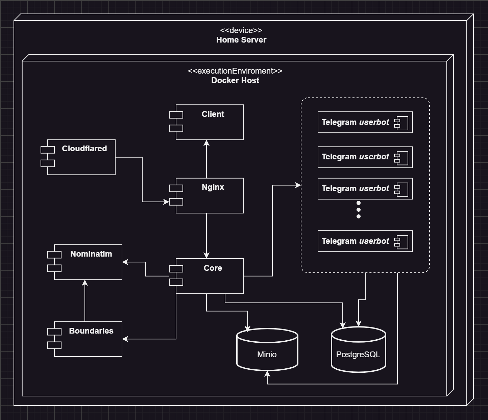
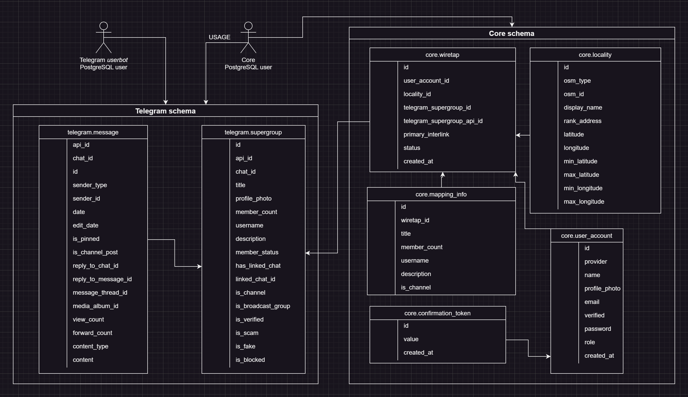

# GeoTalker
*explore what and where people talk about*

---

<!-- TOC -->
* [Description](#description)
  * [Motivation](#motivation)
  * [Goal](#goal)
  * [Privacy considerations](#privacy-considerations)
  * [Future development plan](#business-plan-development)
* [Project Structure](#project-structure)
  * [General deployment scheme](#common-scheme)
  * [services](#services)
    * [Client](#client)
    * [Core](#core)
    * [Nominatim](#nominatim)
    * [Boundaries](#boundaries)
    * [Telegram *userbot*](#telegram-userbot)
    * [Minio](#minio)
    * [Cloudflared + Nginx](#cloudflared--nginx)
    * [PostgreSQL scheme](#postgresql-scheme)
<!-- TOC -->

---

## Description
This application allows you to search and add to its repository Telegram repository channels (both public and private) associated with a specific location on the map and read their history.

### Motivation
The idea for such an application came to my mind when I was searching for Telegram channels that associate to Israel or Palestine 
to learn more about their conflict. I was interested in what people themselves said about their situation in order 
to understand what information from mass media I could trust. This also applies to the Russian-Ukrainian War. 
For example, if you try to find a telegram channel related to the [Kramatorsk](https://www.google.com/maps/place/Kramatorsk,+Donetsk+Oblast/data=!4m2!3m1!1s0x40df97a4c0ea9b9b:0x6cfddec1592678ec?sa=X&ved=1t:242&ictx=111) city and enter *“Краматорск”* into the Telegram search, 
all you can find from the groups offered to you is only [“✙ ЧАТ | Краматорский Район ✙”](https://t.me/Oper_Kramatorskix_chat), which is essentially just a discussion 
of the channel’s posts. Thus, the majority of messages in this group (about 90%) are advertisements and posts from the channel.

At the same time, there is a telegram group [“Chat ᴏɴʟɪɴᴇ 24/7️”](https://t.me/+H1kt7FhYG341ZjQ6). This is a private group, so it cannot be found through a search in Telegram. 
In addition, this group does not have any obvious signs of belonging to any geographical location (other than the immediate conversation 
in the group). Neither the name of the group, nor its photo, nor description refers us to the Kramatorsk city or any other geographical location. 
However, this group has a larger number of participants and they are more active than in other groups related to the city of Kramatorsk, 
which makes this group the most “alive” among others.

### Goal
The main goal is to create a service where visitors can find telegram groups and channels (in the future it is planned to add other social platforms 
such as WeChat and Facebook messenger) associated with administrative or geographical units. Often, administrators of private channels and groups add 
an invitation link to the channel description (the application also contains chats descriptions). This makes it easy for app visitors to access such chats. 
Also, a visitor can be subscribed to such a chat and by logging into the application, he can add this chat to the application database - this is a way 
to replenish the application database.

Use cases:
- Search for groups and channels related to the geographic location you are interested in;
- Adding groups and channels to the system. 
*local regulations, minibus schedule, small local markets or shops, whatever*

Possible usage scenarios:
- Consuming information from groups and channels in case of interest in the culture or news of a certain region (see [Motivation](#Motivation));
- Get local help when traveling to a specific region (local regulations, bus schedule, small local shops and markets, etc.).

### Privacy considerations
The application provides protection against leakage of sensitive data of individual users, groups and channels. 
Participants as well as admins of groups and channels do not have to be afraid to spread information or communicate. 
In order to achieve this GeoTalker replaces username and profile photo with generated output of [Datafaker](https://www.datafaker.net/documentation/usage/). 
Concerning channels and groups, the application stores their data only for one hour.

It is also planned to detect and replace bank card numbers, phone numbers and any sensitive information with fake data.

### Future development plan
If the project has a permanent audience and increases its number, then in the future it is planned to turn it into a tool for mass media workers. 
When the number of groups and chats in the application repository increases significantly, by connecting AI tools it will be possible to create 
a brief description of what people discussed in a certain location in a certain period of time or find the original source which is then cited 
by some mass media.

## Project Structure
### General deployment scheme

### Components
In total there are 9 components in the project. Each component is deployed in a Docker container. All components are deployed using docker-compose. 
Following you can see key statements of each of them:

#### Client
- written using the React framework
- user interface design library – [Material UI](https://mui.com/material-ui/)
- [Mapbox GL JS](https://docs.mapbox.com/mapbox-gl-js/guides) was selected to interact with the map 
- another used tech: yup, formik, notistack, axios, pako

#### Core
- Spring Boot, Spring Security, Validation, e.t.c.
- Mapstruct, Lombok,  [Datafaker](https://www.datafaker.net/documentation/usage/)

#### Nominatim
[Nominatim](https://nominatim.org/release-docs/latest/) (from the Latin, 'by name') is a tool to search [OSM](https://en.wikipedia.org/wiki/OpenStreetMap) data by name and address and to generate synthetic addresses of OSM points (reverse geocoding).

In the context of GeoTalker, Nominatim uses as:
- Database of administrative boundaries
- Database of administrative divisions hierarchy
- Revers geocoding

> Building Nominatim instance for this project (full planet, admin style) requires at least 64Gb RAM and 700Gb of disk (highly recommended fast NVME disk).
Full process on machine with 64Gb RAM, and [CPU](https://www.intel.com/content/www/us/en/products/sku/91768/intel-xeon-processor-e52697a-v4-40m-cache-2-60-ghz/specifications.html)
with 32 threads (16 cores) takes 20 hours. After building size of data reduce to ~30Gb.  
see [official doc](https://nominatim.org/release-docs/develop/admin/Import/#filtering-imported-data)

#### Boundaries
Written in JS. Creates boundaries in a very compressed format and puts it to object storage (Minio). 
Takes GeoJson from Nominatim > simplifies it > converts to [TopoJson](https://github.com/topojson/topojson) > compress and puts to object storage. 
These steps are always necessary for efficient fetching and caching in the client browser.

This component is delegated to an external API service mainly for the TopoJson JS library since there is no native or Java library. 
There was made an attempt to use [GraalVM](https://www.graalvm.org/), but a race condition occurred. To avoid this, you need to copy the GraalVM context to each new thread. 
But this way the performance is greatly reduced compared to JS (about 20 times).

#### Telegram *userbot*
This component uses [TDlib](https://core.telegram.org/tdlib) as native library for JS. This userbot has the following goals:
- horizontal scaling
- independence from other components
- minimizing sending requests to Telegram to reduce the likelihood of a ban.

TDlib has its own internal database - SQLite, but the problem when using this database is the loss of data 
(for example, deleting the entire message history from the chat) when Telegram decides to ban such a user bot or the user bot is banned 
by the administrator of some private group/chat. Therefore, it was decided to save all messages in an external PostgreSQL database. See DB Schema section.

At the moment, the Telegram userbot is working in passive mode. This means that we can only receive updates from 
Telegram because it does not send requests (almost) to Telegram. Therefore, currently, when adding a new chat to the map, 
the chat history is not loaded and only new messages are displayed.

#### Minio
[MinIO](https://min.io/) is a high-performance object store compatible with S3. 
Processed borders and, importantly, Telegram files are stored here in one place from Telegram userbots. 
Thus, Telegram userbots do not download a file if it has already been downloaded from another userbot or another session.

#### Cloudflared + Nginx
Cloudflared establishes a tunnel connection to Cloudflare servers and allows you to deploy a project without a public IP address + a basic firewall. 
Nginx works as a simple reverse proxy to manage API requests.

#### Database schema
In Postgresql DB there are two schema: one for Core service and another one for Telegram *userbot* service.
For each schema creates related user:
- Core user has all privileges on schema Core and usage privileges on schema Telegram
- Telegram user has privileges (all) only on schema Telegram

