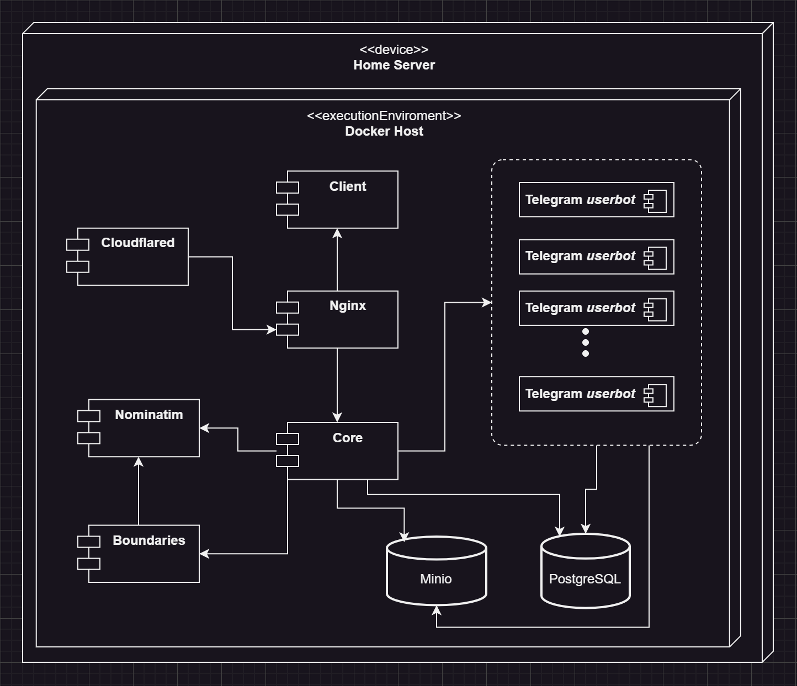

# GeoTalker
*explore what and where people talk about*

---

<!-- TOC -->
* [Description](#description)
  * [Motivation](#motivation)
  * [Goal](#goal)
  * [Privacy considerations](#privacy-considerations)
  * [Business plan development](#business-plan-development)
* [Project Structure](#project-structure)
  * [common scheme](#common-scheme)
  * [services](#services)
    * [Client](#client)
    * [Core](#core)
    * [Nominatim](#nominatim)
    * [Boundaries](#boundaries)
    * [Telegram *userbot*](#telegram-userbot)
    * [Minio](#minio)
    * [Cloudflared + Nginx](#cloudflared--nginx)
    * [PostgreSQL scheme](#postgresql-scheme)
<!-- TOC -->

---

## Description
This application allows search and add to repository Telegram channels and groups (both public and private) related to some place on map and read their history.

### Motivation
Idea of such application visited my mind when I was looking telegram groups related Israel or Palestine during their conflict. 
I was interested what peoples talk about their situation, which info from mass media I can trust. This also applies to Russo-Ukrainian War.
For example try to find telegram channel related to [Kramatorsk](https://www.google.com/maps/place/Kramatorsk,+Donetsk+Oblast/data=!4m2!3m1!1s0x40df97a4c0ea9b9b:0x6cfddec1592678ec?sa=X&ved=1t:242&ictx=111) city!
you can type in telegram search engine *"Краматорск"* and what you can find of groups is only [✙ ЧАТ | Краматорский Район ✙](https://t.me/Oper_Kramatorskix_chat)
that is just chat discussion for broadcast channel. In this chat the most messages (~90 %) are duplicates posts from its channel, plus ads.  
Also in the same time exist telegram group [Chat ᴏɴʟɪɴᴇ 24/7️](https://t.me/+H1kt7FhYG341ZjQ6). 
This group is private, so you can't find it just typing in search field of telegram application.
In additional this group hasn't any identifiers that made relation with some place clear: 
not title, not profile photo, even description doesn't have any mentions belonging to whatever.
But this group is the most alive, active and large of all groups related to Kramatorsk. 

### Goal
The main goal is to create service where visitors could find telegram (in feature also other social-media platforms, like WeChat and FB messenger) related to specific administrative or geographical place.
Often admins of private channel and groups adds invite link in description (description of chats is present in application). So in this case get access to chat by visitors this application becomes easily.
Also, visitor can be subscribed on chat related to his home city, so he can add it to repository — it is how to populate the repository of chats.  
Some usage scenario:
- You are interested in culture and news of some nation (see [Motivation](#Motivation))
- You are traveling abroad, and you want to get some help with local things  
*local regulations, minibus schedule, small local markets or shops, whatever*

### Privacy considerations
The leakage of confidential information of an individual user is not purpose of this project.
Participants of telegram groups should not afraid to talk and spread information.
To achieve this profile photo and name of user is replaced by generated info from [Datafaker](https://www.datafaker.net/documentation/usage/)
and persist during one hour for selected group.  
Also there are planing to trace and replace such info like card numbers, phone numbers and other.

### Business plan development
If project will be a live, in future there are planing to make from this a tool for persons working in mass media:  
when repository of chats will significant increase this project will become a big DB of messages related to specific place.
These messages can process AI and give summary of what are discussing people in current time in specific place,
or find original source of some sensation that spreed thought all media.

## Project Structure
### common scheme

### services
In total there are 9 services in the project. Each service deployed in docker container. And all projects is deployed by docker-compose.
Here their description with its key features:
#### Client
- written with React
- design library — [Material UI](https://mui.com/material-ui/)
- for map interaction was chosen [Mapbox GL JS](https://docs.mapbox.com/mapbox-gl-js/guides)
- yup, formik, notistack, axios, pako

#### Core
- Spring Boot, Spring Security, Validation, e.t.c.
- Mapstruct, Lombok,  [Datafaker](https://www.datafaker.net/documentation/usage/)

#### Nominatim
[Nominatim](https://nominatim.org/release-docs/latest/) (from the Latin, 'by name') is a tool to search [OSM](https://en.wikipedia.org/wiki/OpenStreetMap) data by name and address and to generate synthetic addresses of OSM points (reverse geocoding).

In the context of GeoTalker, Nominatim uses as:
- Database of administrative boundaries
- Database of administrative divisions hierarchy
- Revers geocoding

> Building Nominatim instance for this project (full planet, admin style) requires at least 64Gb RAM and 700Gb of disk (highly recommended fast NVME disk).
Full process on machine with 64Gb RAM, and [CPU](https://www.intel.com/content/www/us/en/products/sku/91768/intel-xeon-processor-e52697a-v4-40m-cache-2-60-ghz/specifications.html)
with 32 threads (16 cores) takes 20 hours. After building size of data reduce to ~30Gb.  
see [official doc](https://nominatim.org/release-docs/develop/admin/Import/#filtering-imported-data)

#### Boundaries
Written on JS. Create boundaries in very compressed format and put it to object storage (Minio). 
Takes GeoJson from Nominatim > simplify it > converts to [TopoJson](https://github.com/topojson/topojson) > compress and put to object storage.
These steps are permanently needed for effective fetching and caching on client browser.

This service is delegated in external api service mostly for TopoJson JS library, because there are no native or Java library.
An attempt was made to use [GraalVM](https://www.graalvm.org/), but problem related to race condition was occurred. 
To avoid this there are needed copy GraalVM context in each new thread. But in this way performance compared to JS is very reduced (about ~20 times).

#### Telegram *userbot*
This service use [TDlib](https://core.telegram.org/tdlib) as native library for JS. This userbot pursues the following goals:
- horizontal scaling
- independent of another services
- minimize sending requests to Telegram to reduce ban probability.

TDlib has own inner DB - SQLite, but problem in using this DB is losing data (for example removes all message history from chat) when telegram decide to ban such userbot 
or userbot is bans by admin of some private group. So, was decided to save all messages in external DB PostgreSQL. See section DB scheme 

For now, telegram userbot works in *passive* mode. It means that only updates from telegram we can get, 
because it does not send queries (almost) to telegram. So currently with adding new chat on the map chat history not loads, 
and only new message will be showed.

#### Minio
[MinIO](https://min.io/) is a high-performance, S3 compatible object store.
Here stores processed boundaries and more important - telegram files in one place from telegram userbots. 
In this way telegram userbots don't download file if it is already downloaded from another userbot or another session.

#### Cloudflared + Nginx
Cloudflared establish tunnel connection with Cloudflare servers and allow to deploy project without public IP, + basic firewall.
Nginx works as simple reverse proxy server to manage api queries.

#### PostgreSQL scheme
In Postgresql DB there are two schema: one for Core service and another one for Telegram *userbot* service.
For each schema creates related user:
- Core user has all privileges on schema Core and usage privileges on schema Telegram
- Telegram user has privileges (all) only on schema Telegram

